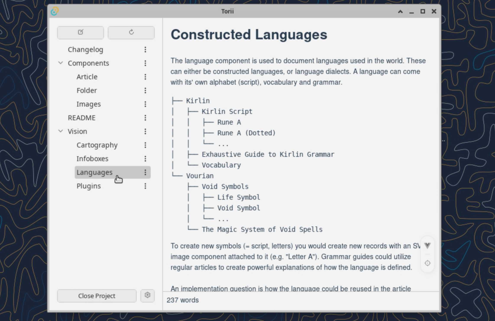

# Torii Project （鳥居Ｐｒｏｊｅｃｔ）

Torii Project is a tool for world builders and story writers to document vast worlds. Currently Torii supports managing markdown notes.

### Torii Design Philosopy

**Records.** The idea is simple: Every element of a story is a "record", for example the character "Sarah Vermillion", the location "Adamant Mounts", the city of "Löwenherz", the in-world playing card deck "Trial Cards" and the constructed language "Kirlin".

In other words, every “thing" that has its' own page in the encyclopedia of your fantasy is a "record". Every record is represented by at least a name and one file in the workspace directory: Usually it has the markdown note where you can write prose and lore, but every image, every map, every folder and every object you add to the encyclopedia is also a record.

**Components.** Let's say you have the map layout of the "Pirate Bay" island in mind. You can write about it in the markdown file, but it is limited at text processing and cannot draw you the island. A "map" component would be attached to the Pirate Bay and you would be able to both "draw" and "document" the "record" "Pirate Bay".

In other words, "Pirate Bay" is a "record". We do not know wether it is an image, or an article, or a language, or a location, or anything else. We add "components" which define the nature and behaviour of this record. The "components" for "Pirate bay" would be: "Map" and "Article".

**Summary.** "Record" is an atomic element of the world. "Component" is an atomic reusable pattern on elements. Their relation is what brings a Torii workspace to life.

### Contributing

If you have programming skills and would like to help out with the application, see the [Contributing](https://github.com/Anatoly03/Torii?tab=contributing-ov-file) guide on how to run the application in development mode and access the in-app developer guides. If you need inspiration and ideas on what feature could be added, please take a look at the planned [Roadmap](https://github.com/Anatoly03/Torii/blob/master/ROADMAP.md), although it's more of a mental guideline than a command.
